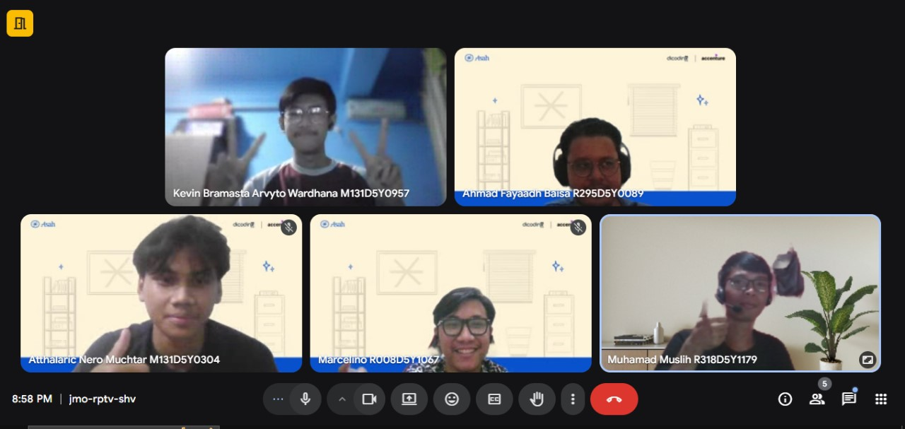
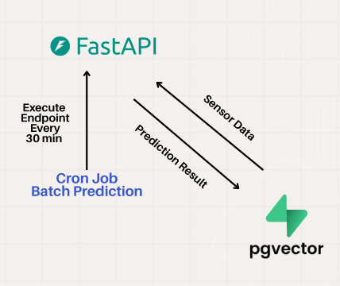
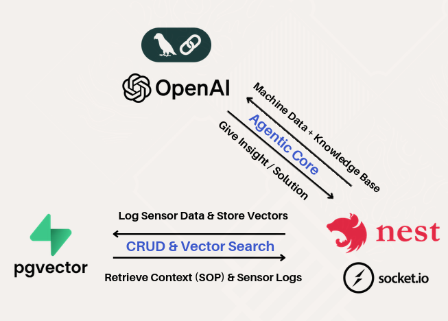
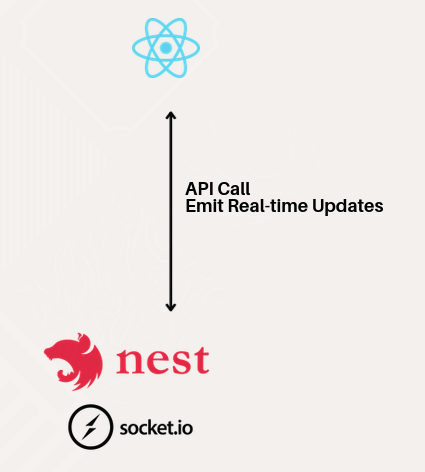

**Disclaimer:** the tech stack that listed above is only the technologies that my friend and I used to during the project, but the project itself is not limited to those technologies.

import StackLink from "../../components/miscellaneous/StackLink.astro";

before we start, shout out to this great engineer, couldn't have done it without them 

｡：ﾟﾟ(´∀｀)･｡
- [Athallaric Nero Muchtar](https://www.linkedin.com/in/atthalaricneromuchtar/)
- [Marcelino](https://www.linkedin.com/in/marcelino1/)
- [Ahmad Fayaadh Baisa](https://www.linkedin.com/in/ahmad-fayaadh-baisa/)
- [Muhamad Muslih](https://www.linkedin.com/in/muhamad-muslih-a92120275/)

## overview

Let's get you guys up to speed first. This project was in collaboration of a program called [dicoding asah](https://www.dicoding.com/asah)

tl;dr, this program is a 6 months program where you will learn specific learning path and in the end you will build a capstone project based on a real problem that they give.

## why?

The problem that we got is about the energy industry, more specifically about the maintenance of the assets in the energy industry.

As you can imagine, the energy industry is a very complex industry with a lot of assets that need to be maintained regularly. And the problem is that the maintenance process is still done manually, which is not only time-consuming but also prone to human error. So, our task is to create a solution that can help the maintenance process to be more efficient and effective.

## how it works

Let's divide this into three parts starting with:

### machine learning

Since we don't have access to a real dataset, we were told to use this dataset called [machine-predictive-maintenance-classification](https://www.kaggle.com/datasets/shivamb/machine-predictive-maintenance-classification/data), which is a synthetic dataset that reflects real predictive maintenance encountered in the industry to the best of their knowledge.

We use lstm rul and xgboost for the machine learning part, and we use <StackLink name="fastapi"/> to create an api for the machine learning model, and we also use fastcron to schedule the machine learning model to run every 30 minutes.

For how it works, I'll create separate documentation later, but in short, the machine learning model will take the data from the dataset and first it checks if there is any machine that has failure, if there is, it will predict what category of failure it is, and then it will predict the remaining useful life of the machine. And then it will store the result in the database.

### backend

For the backend, our team (more like my backend team) decided to use <StackLink name="nestjs"/> and <StackLink name="socket.io"/> for communicating with the frontend with real-time monitoring. We also uses langchain for the ai copilot part.

The backend will receive the data from the <StackLink name="supabase"/>, and then it will also send the data to the frontend for real-time monitoring. And for the ai copilot part, it will use <StackLink name="langchain"/> to generate insights and recommendations based on the data that it receives from the machine learning model.

We also implement **rag (retrieval-augmented generation)** for the ai copilot, so that it can retrieve relevant information from the document that we create so it will follow the guidelines on how it will fix the machines.

### frontend

Frontend is relatively simple, we use <StackLink name="react"/> and <StackLink name="vite"/> for the frontend part. The frontend will display the data that it receives from the backend in a dashboard format using <StackLink name="socket.io"/>, and it will also display the insights and recommendations from the ai copilot.

---

If you want to see the code (since it's a long text), you can check out our **github** repository above.

sorry for the long yapping session :|
